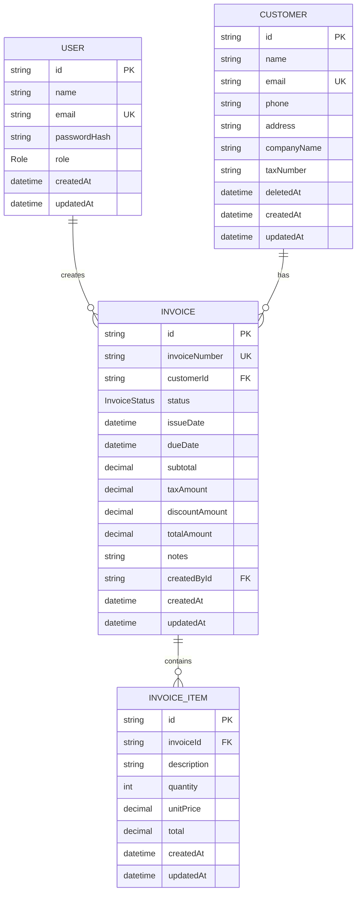

# ERD / Database Schema

## Entities

### User

| Field | Type | Notes |
|---|---|---|
| id | String UUID | Primary key |
| name | String | Required |
| email | String | Unique |
| passwordHash | String | bcrypt hash |
| role | Role | `ADMIN` or `STAFF` |
| createdAt | DateTime | Auto created |
| updatedAt | DateTime | Auto updated |

### Customer

| Field | Type | Notes |
|---|---|---|
| id | String UUID | Primary key |
| name | String | Required |
| email | String | Unique |
| phone | String? | Optional |
| address | String? | Optional |
| companyName | String? | Optional |
| taxNumber | String? | Optional |
| deletedAt | DateTime? | Soft delete marker |
| createdAt | DateTime | Auto created |
| updatedAt | DateTime | Auto updated |

### Invoice

| Field | Type | Notes |
|---|---|---|
| id | String UUID | Primary key |
| invoiceNumber | String | Unique, e.g. `INV-2026-0001` |
| customerId | String | FK to Customer |
| status | InvoiceStatus | `DRAFT`, `SENT`, `PAID`, `CANCELLED`, `OVERDUE` |
| issueDate | DateTime | Required |
| dueDate | DateTime | Required |
| subtotal | Decimal(14,2) | Backend calculated |
| taxAmount | Decimal(14,2) | Defaults 0 |
| discountAmount | Decimal(14,2) | Defaults 0 |
| totalAmount | Decimal(14,2) | Backend calculated |
| notes | String? | Optional |
| createdById | String | FK to User |
| createdAt | DateTime | Auto created |
| updatedAt | DateTime | Auto updated |

### InvoiceItem

| Field | Type | Notes |
|---|---|---|
| id | String UUID | Primary key |
| invoiceId | String | FK to Invoice |
| description | String | Required |
| quantity | Int | Required |
| unitPrice | Decimal(14,2) | Required |
| total | Decimal(14,2) | Backend calculated |
| createdAt | DateTime | Auto created |
| updatedAt | DateTime | Auto updated |

## Relationships

- User creates many invoices.
- Customer has many invoices.
- Invoice has many invoice items.
- Invoice item belongs to one invoice.

## Mermaid ERD

